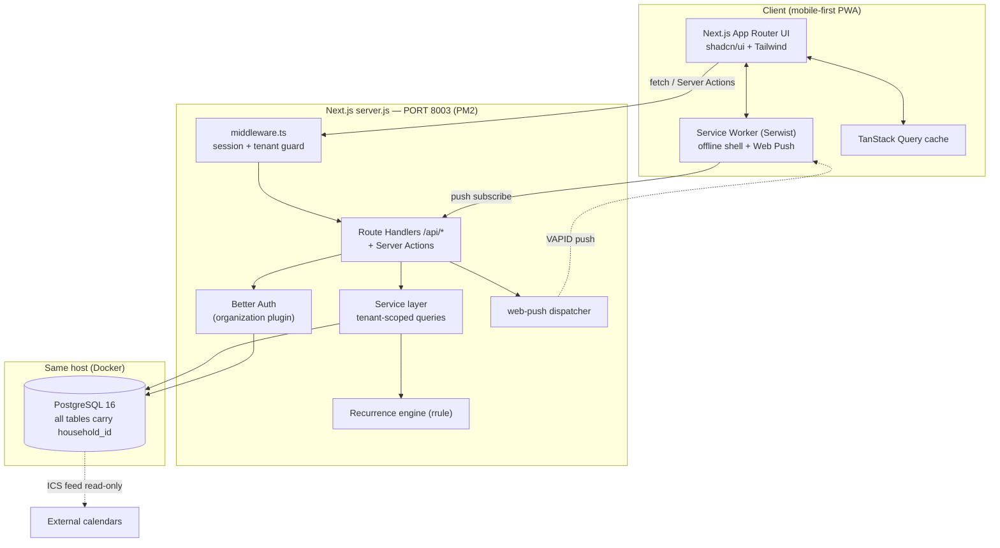
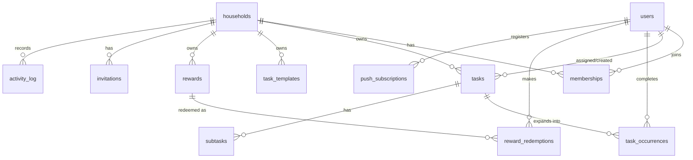

# Family Task Scheduler — Technical Specification

> Status: APPROVED FOR BUILD · Owner: Architect · Date: 2026-05-30
> Source research: `docs/research.md` · Stack rationale: `docs/stack-decision.md`

---

## 1. Executive Summary

A production-ready, multi-tenant SaaS web app that lets families organize, assign,
schedule, and gamify household tasks. Each **household** is an isolated tenant; members
have **parent** (admin) or **child** roles. Parents create and assign recurring or one-off
tasks; children complete them, earn points, and redeem rewards. The app is mobile-first,
fully dark-mode capable, installable as a PWA, and self-hosted on a single server bound to
**PORT 8003**, reachable at **http://100.118.254.91:8003** over Tailscale.

The product is delivered as a **single Next.js 15 application** (App Router) — UI, API
(Route Handlers + Server Actions), and auth in one deployable unit backed by a Postgres
database running in Docker on the same host. This minimizes operational surface for a
single-server deployment while remaining horizontally scalable later.

### Scope (MVP — Phase 1, this build)
Authentication, household creation + email/link invitations, parent/child roles, task CRUD,
direct assignment, recurring tasks (daily/weekly/monthly), task status workflow with optional
parent approval, points on completion, rewards catalog + redemption, basic month/week/day
calendar view, activity feed, dashboard, mobile-responsive layout with bottom-tab nav,
dark mode, PWA install + offline shell, and multi-tenant data isolation.

### Non-Goals (explicitly deferred)
- Native iOS/Android apps (PWA only for now).
- Two-way Google Calendar sync (read-only ICS export feed only in MVP).
- Real-time WebSocket push (MVP uses polling + SWR revalidation; architecture leaves a
  seam for Server-Sent Events later).
- Billing / paid tiers / Stripe.
- File/photo attachments and per-task comment threads (schema reserved, UI deferred).
- Achievement badges, leaderboards, streak bonuses (point totals only in MVP).
- Native mobile push notifications (in-app + Web Push notifications only).

---

## 2. Chosen Stack

| Layer | Choice | One-line reason |
|---|---|---|
| Framework | **Next.js 15** (App Router, `output: "standalone"`) | One deployable unit (UI+API+auth); self-hosts cleanly on a fixed port. |
| Language | **TypeScript 5.x** (strict) | Type safety end-to-end across DB → API → UI. |
| Styling | **Tailwind CSS v4** | Mobile-first utilities; `dark:` variant for built-in dark mode. |
| Components | **shadcn/ui** (Radix primitives) | Accessible, unstyled-but-themed components; saves weeks; theme = CSS vars. |
| ORM | **Drizzle ORM** | Typed SQL, you-own-the-migrations (`drizzle-kit`), tiny runtime, great for a single Postgres server. |
| Database | **PostgreSQL 16** (Docker, same host) | JSONB, partial indexes, robust constraints; the multi-tenant `household_id` model is trivial to index. |
| Auth | **Better Auth** + `organization` plugin | Self-hosted, no per-user cost, first-class multi-tenant orgs + RBAC; 2026 default for new projects. |
| Validation | **Zod** | Runtime validation shared between Route Handlers and forms; infers TS types. |
| Data fetching | **TanStack Query (React Query) v5** | Caching, optimistic updates for one-tap complete/undo, polling for near-real-time. |
| Recurrence | **rrule** (RFC 5545) | Standard recurrence engine; serializes to a string we store and re-expand. |
| Dates | **date-fns** + **@date-fns/tz** | Lightweight, tree-shakeable, timezone-correct. |
| Theme toggle | **next-themes** | Class-based dark mode with no FOUC, system preference aware. |
| PWA / offline | **Serwist** (next-pwa successor) | Service worker, offline app shell, Web Push. |
| Notifications | **web-push** (VAPID) | Standards-based Web Push, no third-party SaaS. |
| Process mgmt | **Node `server.js`** (standalone) behind **PM2** | Binds `PORT=8003`, auto-restart on the Mac Studio host. |

**Alternatives evaluated** (full analysis in `docs/stack-decision.md`):
1. Next.js + Prisma + Postgres + Auth.js v5 — heavier ORM, beta auth with migration pain.
2. Separate FastAPI/Postgres backend + Next.js frontend — two deploy units, more ops for one server.
3. Next.js + Supabase (managed Postgres+Auth+Realtime) — rejected: deploy target is a self-hosted
   Tailscale host, external managed DB adds network dependency and conflicts with the single-host model.

---

## 3. Architecture



**Request flow & tenant resolution**
1. `middleware.ts` runs on every protected route: validates the Better Auth session cookie,
   resolves `activeOrganizationId` (= `household_id`), and rejects unauthenticated requests.
2. Route Handlers/Server Actions never accept `household_id` from the client. The service
   layer reads it from the authenticated session and injects it into every query
   (`WHERE household_id = :session.householdId`). This is the **single enforcement point**
   for tenant isolation (defense in depth below adds DB constraints + optional RLS).
3. Mutations validate input with Zod, run authorization checks (role + ownership), write,
   append to `activity_log`, and enqueue notifications.

---

## 4. Data Model

All tenant tables carry a non-null `household_id` FK. All ids are UUID v4 (text). Timestamps
are `timestamptz`. Soft-delete via `deleted_at` on `tasks` and `rewards`.

### Entity relationship



### 4.1 Auth tables (managed by Better Auth — names per its schema)
- **user** — `id`, `name`, `email` (unique), `emailVerified`, `image`, `createdAt`, `updatedAt`.
- **session** — `id`, `userId`, `token`, `expiresAt`, `ipAddress`, `userAgent`,
  `activeOrganizationId` (the active household).
- **account** — credential/oauth records, hashed password (scrypt via Better Auth), provider data.
- **verification** — email verification + password-reset tokens.
- **organization** — `id`, `name`, `slug` (unique), `logo`, `metadata`, `createdAt`.
  **This is the `households` tenant entity** (aliased as "household" in product copy).
- **member** — `id`, `organizationId`, `userId`, `role` (`owner`|`admin`|`member`), `createdAt`.
  We map app roles onto this: `owner`/`admin` → **parent**, `member` → **child**.
- **invitation** — `id`, `organizationId`, `email`, `role`, `status`, `inviterId`, `expiresAt`.

> The Better Auth `organization` plugin provides `organization`, `member`, and `invitation`
> tables out of the box. App-domain tables below reference `organization.id` as `household_id`.

### 4.2 Application tables

**households_profile** (1:1 extension of `organization`)
| column | type | notes |
|---|---|---|
| household_id | uuid PK FK→organization.id | |
| timezone | text NOT NULL default 'UTC' | IANA tz, drives recurrence + reminders |
| week_starts_on | smallint default 0 | 0=Sun..6=Sat |
| points_enabled | boolean default true | gamification toggle |
| approval_required | boolean default false | parent must approve child completions |
| created_at | timestamptz default now() | |

**member_profile** (1:1 extension of `member`, per-household member state)
| column | type | notes |
|---|---|---|
| id | uuid PK | |
| household_id | uuid FK NOT NULL | tenant |
| user_id | uuid FK→user.id NOT NULL | |
| display_name | text | overrides user.name within household |
| avatar_color | text | UI color token |
| points_balance | integer default 0 | denormalized; recomputed from ledger |
| birthdate | date NULL | optional, for age-appropriate UI |
| UNIQUE(household_id, user_id) | | |

**tasks**
| column | type | notes |
|---|---|---|
| id | uuid PK | |
| household_id | uuid FK NOT NULL | tenant |
| title | text NOT NULL | |
| description | text NULL | |
| category | text NULL | chores/homework/shopping/appointments/custom |
| priority | smallint default 1 | 0=low,1=med,2=high |
| assigned_to | uuid FK→user.id NULL | null = unassigned/claimable |
| created_by | uuid FK→user.id NOT NULL | |
| point_value | integer default 0 | |
| estimate_minutes | integer NULL | |
| due_at | timestamptz NULL | one-off due date/time |
| recurrence_rule | text NULL | RFC5545 RRULE string; null = one-off |
| recurrence_end | timestamptz NULL | optional UNTIL bound |
| is_template_origin | uuid FK→task_templates.id NULL | provenance |
| created_at, updated_at | timestamptz | |
| deleted_at | timestamptz NULL | soft delete |

Indexes: `(household_id)`, `(household_id, assigned_to)`, `(household_id, due_at)`,
partial `(household_id) WHERE deleted_at IS NULL`.

**task_occurrences** (concrete instances; recurring tasks expand into these on demand/write)
| column | type | notes |
|---|---|---|
| id | uuid PK | |
| household_id | uuid FK NOT NULL | tenant |
| task_id | uuid FK→tasks.id NOT NULL | |
| occurrence_date | date NOT NULL | the scheduled day |
| status | text default 'todo' | todo / in_progress / pending_approval / completed / skipped |
| completed_by | uuid FK→user.id NULL | |
| completed_at | timestamptz NULL | |
| approved_by | uuid FK→user.id NULL | |
| points_awarded | integer default 0 | snapshot at completion |
| UNIQUE(task_id, occurrence_date) | | idempotent expansion |

Index: `(household_id, occurrence_date, status)`, `(household_id, completed_by)`.

**subtasks**
| column | type | notes |
|---|---|---|
| id | uuid PK | |
| household_id | uuid FK NOT NULL | tenant |
| task_id | uuid FK→tasks.id NOT NULL | |
| title | text NOT NULL | |
| is_done | boolean default false | |
| sort_order | integer default 0 | |

**task_templates**
| column | type | notes |
|---|---|---|
| id | uuid PK | |
| household_id | uuid FK NULL | null = global system template (seeded) |
| title, description, category | text | |
| default_point_value | integer default 0 | |
| default_estimate_minutes | integer NULL | |
| suggested_recurrence | text NULL | RRULE |

**rewards**
| column | type | notes |
|---|---|---|
| id | uuid PK | |
| household_id | uuid FK NOT NULL | tenant |
| name | text NOT NULL | |
| description | text NULL | |
| icon | text NULL | emoji/icon token |
| point_cost | integer NOT NULL | |
| is_active | boolean default true | |
| created_by | uuid FK→user.id NOT NULL | |
| created_at | timestamptz | |
| deleted_at | timestamptz NULL | |

**reward_redemptions**
| column | type | notes |
|---|---|---|
| id | uuid PK | |
| household_id | uuid FK NOT NULL | tenant |
| user_id | uuid FK→user.id NOT NULL | child redeeming |
| reward_id | uuid FK→rewards.id NOT NULL | |
| points_spent | integer NOT NULL | snapshot |
| status | text default 'pending' | pending / approved / fulfilled / denied |
| approved_by | uuid FK→user.id NULL | parent |
| redeemed_at | timestamptz default now() | |

**points_ledger** (source of truth for balances)
| column | type | notes |
|---|---|---|
| id | uuid PK | |
| household_id | uuid FK NOT NULL | tenant |
| user_id | uuid FK→user.id NOT NULL | |
| delta | integer NOT NULL | +earn / −spend |
| reason | text NOT NULL | task_completed / reward_redeemed / manual_adjust |
| ref_occurrence_id | uuid NULL | |
| ref_redemption_id | uuid NULL | |
| created_at | timestamptz default now() | |

**activity_log**
| column | type | notes |
|---|---|---|
| id | uuid PK | |
| household_id | uuid FK NOT NULL | tenant |
| user_id | uuid FK→user.id NOT NULL | actor |
| action_type | text NOT NULL | task_created/assigned/completed/approved/reward_redeemed/member_joined |
| task_id | uuid NULL | |
| points_change | integer default 0 | |
| metadata | jsonb NULL | |
| created_at | timestamptz default now() | |

Index: `(household_id, created_at DESC)`.

**push_subscriptions**
| column | type | notes |
|---|---|---|
| id | uuid PK | |
| household_id | uuid FK NOT NULL | tenant |
| user_id | uuid FK→user.id NOT NULL | |
| endpoint | text NOT NULL UNIQUE | |
| p256dh, auth | text NOT NULL | Web Push keys |
| created_at | timestamptz | |

### 4.3 Recurrence handling
`tasks.recurrence_rule` stores an RRULE. On read of a date range (calendar/dashboard) the
service expands the rule with `rrule` into the requested window and **upserts** missing
`task_occurrences` (idempotent via `UNIQUE(task_id, occurrence_date)`). Completion always
acts on a concrete `task_occurrences` row. One-off tasks get a single occurrence at `due_at`.

---

## 5. API Contract

REST under `/api`. All routes (except auth + public legal pages) require a valid session.
Tenant (`household_id`) is **always** derived server-side from `session.activeOrganizationId`,
never from the request body. All responses are JSON. Errors use a consistent envelope:
`{ "error": { "code": string, "message": string, "details"?: object } }`.
Standard codes: 400 validation, 401 unauthenticated, 403 forbidden (role/tenant),
404 not found, 409 conflict, 429 rate-limited.

### 5.1 Auth (handled by Better Auth at `/api/auth/*`)
| Method | Path | Purpose |
|---|---|---|
| POST | `/api/auth/sign-up/email` | Register `{ name, email, password }` → creates user, sends verification |
| POST | `/api/auth/sign-in/email` | Login `{ email, password }` → sets session cookie |
| POST | `/api/auth/sign-out` | Clear session |
| GET  | `/api/auth/get-session` | Current user + active household |
| POST | `/api/auth/forget-password` / `/reset-password` | Password reset flow |
| POST | `/api/auth/organization/create` | Create household `{ name, slug }` → owner=parent |
| POST | `/api/auth/organization/invite-member` | Invite `{ email, role }` → emails link/token |
| POST | `/api/auth/organization/accept-invitation` | `{ invitationId }` joins household |
| POST | `/api/auth/organization/set-active` | Switch active household `{ organizationId }` |

### 5.2 Application endpoints

**Tasks**
```
GET /api/tasks?from=2026-06-01&to=2026-06-30&assignee=<userId>&status=todo
200 → { tasks: Task[], occurrences: Occurrence[] }   // occurrences expanded for range

POST /api/tasks
body: {
  title: string (1..120), description?: string, category?: string,
  priority?: 0|1|2, assignedTo?: uuid|null, pointValue?: int>=0,
  estimateMinutes?: int, dueAt?: ISODateTime,
  recurrenceRule?: string /* RRULE */, recurrenceEnd?: ISODateTime,
  subtasks?: { title: string }[]
}
201 → { task: Task }
403 if caller role !== parent

PATCH /api/tasks/:id        // parent only; partial update, same shape as POST
200 → { task: Task }

DELETE /api/tasks/:id       // parent only; soft delete
204
```

**Task occurrences (the day-to-day workflow)**
```
POST /api/occurrences/:id/complete
  // child (if assigned) or parent. If household.approval_required and actor is child:
  // status → pending_approval; else status → completed, award points to ledger.
200 → { occurrence: Occurrence, pointsAwarded: int, newBalance: int }

POST /api/occurrences/:id/uncomplete   // undo within session; reverses ledger entry
200 → { occurrence: Occurrence, newBalance: int }

POST /api/occurrences/:id/approve      // parent only; finalizes pending_approval, awards points
200 → { occurrence: Occurrence }

POST /api/occurrences/:id/status       // body { status: 'in_progress'|'skipped' }
200 → { occurrence: Occurrence }
```

**Members**
```
GET   /api/members                 → { members: MemberProfile[] }  // with points_balance
PATCH /api/members/:userId         → parent only; { displayName?, avatarColor?, birthdate? }
POST  /api/members/:userId/points  → parent only; manual adjust { delta, reason }
```

**Rewards**
```
GET    /api/rewards                          → { rewards: Reward[] }
POST   /api/rewards    (parent)              → { reward }
PATCH  /api/rewards/:id (parent)             → { reward }
DELETE /api/rewards/:id (parent, soft)       → 204
POST   /api/rewards/:id/redeem (child/parent)
   // checks balance >= point_cost; creates redemption (pending if approval_required),
   // debits ledger on approval/auto.
   200 → { redemption, newBalance }
POST   /api/redemptions/:id/approve (parent) → { redemption }
GET    /api/redemptions?status=pending       → { redemptions: Redemption[] }
```

**Calendar / feed / dashboard**
```
GET /api/calendar?view=month&date=2026-06-15 → { occurrences: Occurrence[] }
GET /api/calendar.ics                         → text/calendar  (read-only feed, token-auth in query)
GET /api/activity?limit=50&cursor=<id>        → { items: Activity[], nextCursor }
GET /api/dashboard                            → { todayCount, overdueCount, myTasks, leaderboard }
```

**Templates & notifications**
```
GET  /api/templates                          → { templates }   // global + household
POST /api/tasks/from-template (parent)        → { task }        // { templateId, overrides }
POST /api/push/subscribe                      → 201  { endpoint, keys:{p256dh,auth} }
POST /api/push/unsubscribe                    → 204
GET  /api/export (parent)                     → application/json  // GDPR data export of household
```

### 5.3 Representative response schema
```jsonc
// Task
{
  "id": "uuid", "householdId": "uuid", "title": "Take out trash",
  "description": null, "category": "chores", "priority": 1,
  "assignedTo": "uuid|null", "createdBy": "uuid", "pointValue": 10,
  "estimateMinutes": 5, "dueAt": null,
  "recurrenceRule": "FREQ=WEEKLY;BYDAY=MO,TH", "recurrenceEnd": null,
  "subtasks": [{ "id":"uuid","title":"Empty bins","isDone":false }],
  "createdAt": "2026-05-30T10:00:00Z", "updatedAt": "2026-05-30T10:00:00Z"
}
// Occurrence
{
  "id": "uuid", "taskId": "uuid", "occurrenceDate": "2026-06-02",
  "status": "todo", "completedBy": null, "completedAt": null,
  "pointsAwarded": 0, "task": { /* embedded summary */ }
}
```

---

## 6. Authentication & Authorization

### 6.1 Authentication (Better Auth)
- **Email + password** primary (scrypt hashing built into Better Auth). Email verification
  required before joining/creating a household. Password reset via emailed token.
- **OAuth (Google)** optional provider, wired but feature-flagged via env (`GOOGLE_CLIENT_ID`);
  disabled gracefully if unset.
- **Sessions** are server-side, stored in Postgres, delivered via **secure, httpOnly,
  SameSite=Lax** cookies. 7-day rolling expiry. CSRF handled by Better Auth + SameSite.
- Email delivery via SMTP (env-configured); in dev/no-SMTP, verification/reset links are
  logged to server console so the flow remains testable on the Tailscale host.

### 6.2 Multi-tenancy & active household
- A **household = Better Auth `organization`**. A user may belong to multiple households
  (e.g., separated parents, grandparent helping two families). `session.activeOrganizationId`
  selects the current tenant; a household switcher in the UI calls `organization/set-active`.
- The **first user to create a household becomes `owner` (parent)**. Invites assign `member`
  (child) or `admin` (co-parent).

### 6.3 Authorization (RBAC)
| Capability | parent (owner/admin) | child (member) |
|---|---|---|
| View household tasks/calendar/feed | ✅ all | ✅ all (read) |
| Create / edit / delete tasks | ✅ | ❌ |
| Assign tasks | ✅ | ❌ |
| Complete occurrence | ✅ any | ✅ only if `assignedTo` = self or unassigned/claimable |
| Approve completion / redemption | ✅ | ❌ |
| Manage rewards | ✅ | ❌ |
| Redeem reward (own points) | ✅ | ✅ |
| Manage members / manual point adjust | ✅ | ❌ |
| Invite members | ✅ | ❌ |
| Export data | ✅ (owner) | ❌ |

- Authorization is enforced **server-side** in the service layer using
  `session.user.role` (from `member`) + ownership checks. UI hides disallowed actions but the
  server is the source of truth.

### 6.4 Tenant isolation (defense in depth)
1. **App layer (primary):** every query is built through a `withTenant(householdId)` helper
   that injects `WHERE household_id = $session.householdId`. Request bodies are stripped of
   any `householdId` before use.
2. **DB constraints:** all FKs are composite where practical (e.g. an occurrence's `task_id`
   must belong to the same `household_id`), preventing cross-tenant references.
3. **Optional Postgres RLS:** migration ships RLS policies keyed on a per-request
   `SET app.current_household` GUC, enabled in production as a backstop.
4. **Middleware:** rejects requests whose session lacks an active household; redirects to
   onboarding.

---

## 7. UI / UX Requirements

- **Mobile-first**: layouts designed at 360px first, enhanced for tablet/desktop. Bottom tab
  bar on mobile (Tasks · Calendar · Family · Rewards · Profile); sidebar on ≥`md`.
- **Dark mode**: `next-themes` class strategy, system-aware, manual toggle persisted; all
  shadcn tokens defined for light + dark; no flash of wrong theme (SSR-safe).
- **One-tap actions**: complete (with celebratory check animation), undo toast, swipe-to-complete
  on task cards, FAB for quick-add (parents).
- **Touch targets** ≥ 44×44px; skeleton loaders on all data views; optimistic updates via
  TanStack Query for complete/uncomplete.
- **Onboarding**: create-or-join household → set timezone → invite members → seeded template tasks.
- **PWA**: installable, app shell works offline; queued completions sync on reconnect (best-effort).
- **Accessibility**: keyboard navigable, ARIA via Radix, visible focus, color-contrast AA.
- **Legal**: `/privacy` and `/terms` pages; cookie/consent notice; COPPA note (parent-managed
  child accounts, no direct child PII collection beyond display name).

---

## 8. Acceptance Criteria — Definition of "Production-Ready"

The Critic verifies each item verbatim. The build is **done** when ALL pass.

### A. MVP feature completeness
- [ ] A1. New user can sign up with email+password and receives/verifies email (link logged if no SMTP).
- [ ] A2. User can create a household and is assigned the **parent** role.
- [ ] A3. Parent can invite a member by email/link; invitee can accept and join as **child**.
- [ ] A4. Parent can create a task with title, category, priority, assignee, points, due date.
- [ ] A5. Parent can create a **recurring** task (daily, weekly-by-day, monthly) that correctly
      expands into occurrences across the calendar range.
- [ ] A6. Assigned child can mark an occurrence complete; points are credited to their balance.
- [ ] A7. With `approval_required` on, child completion enters `pending_approval` and a parent
      can approve; points credit only on approval.
- [ ] A8. Complete → Undo reverses status and points ledger correctly.
- [ ] A9. Parent can create rewards; a member with sufficient points can redeem one and balance debits.
- [ ] A10. Calendar shows month/week/day views with occurrences on correct dates per timezone.
- [ ] A11. Activity feed records create/assign/complete/approve/redeem events for the household.
- [ ] A12. Dashboard shows today's tasks, overdue count, my tasks, and a points summary.

### B. Mobile responsive + dark mode
- [ ] B1. App is fully usable at 360px width: bottom-tab nav, no horizontal scroll, ≥44px targets.
- [ ] B2. Layout adapts to tablet/desktop (sidebar nav at ≥768px).
- [ ] B3. Dark mode toggles via UI control, follows system preference by default, persists across
      reloads, with no flash of incorrect theme; all screens legible in both themes.
- [ ] B4. App is installable as a PWA and shows an offline app shell when network is unavailable.

### C. Authentication functional
- [ ] C1. Unauthenticated access to any app route redirects to sign-in.
- [ ] C2. Sessions persist via secure httpOnly cookies; sign-out clears the session.
- [ ] C3. Password reset flow works end-to-end (token-based).
- [ ] C4. A user in multiple households can switch active household and sees only that tenant's data.

### D. Multi-tenant data isolation
- [ ] D1. A user in Household A cannot read, list, or mutate any task/reward/member/occurrence
      belonging to Household B — verified by an automated cross-tenant test that expects 403/404.
- [ ] D2. No API endpoint accepts `householdId` from the client; it is always derived from session
      (code-review + test asserting injected body is ignored).
- [ ] D3. Composite FK / RLS backstop prevents cross-tenant references even if app layer is bypassed.

### E. Performance targets
- [ ] E1. First contentful load of the dashboard ≤ 3.0s on a throttled "Fast 3G"-equivalent profile;
      Lighthouse Performance ≥ 85 on mobile.
- [ ] E2. Interactive actions (complete/undo, navigation) feel instant: optimistic UI ≤ 200ms;
      server round-trip p95 ≤ 400ms on the host.
- [ ] E3. Task list / calendar queries paginate or bound by date range; no unbounded fetch; key
      indexes present on `household_id`, `(household_id,due_at)`, `(household_id,occurrence_date,status)`.

### F. Security requirements
- [ ] F1. Passwords hashed (scrypt via Better Auth); no plaintext secrets in repo; secrets in `.env`.
- [ ] F2. All API inputs validated with Zod; invalid input returns 400 with the error envelope.
- [ ] F3. CSRF protection active (SameSite cookies + Better Auth); mutations reject cross-site.
- [ ] F4. Rate limiting on auth + mutation endpoints (e.g. 100 req/min/IP, stricter on auth).
- [ ] F5. Security headers set (CSP, X-Content-Type-Options, Referrer-Policy, HSTS-ready).
- [ ] F6. Role checks enforced server-side: a child calling a parent-only endpoint gets 403
      (automated test).

### G. Deployment & operations
- [ ] G1. Server binds to `PORT` from `.env` (8003) and is reachable at `http://100.118.254.91:8003`.
- [ ] G2. `docker-compose` brings up Postgres; `drizzle-kit` migrations apply cleanly from empty DB;
      seed script loads system task templates.
- [ ] G3. `artifacts/deploy_url.txt` contains the public URL; app runs under PM2 (auto-restart).
- [ ] G4. README documents setup, env vars, migration, seed, and run commands.
- [ ] G5. `/privacy` and `/terms` pages exist; `/api/export` returns the household's data as JSON.
- [ ] G6. Health check endpoint `GET /api/health` returns 200 with DB connectivity status.

---

## 9. Environment Variables

| Var | Required | Purpose |
|---|---|---|
| `PORT` | ✅ (8003) | Server bind port (pre-allocated) |
| `DATABASE_URL` | ✅ | Postgres connection string |
| `BETTER_AUTH_SECRET` | ✅ | Session/crypto secret (generate, never commit) |
| `BETTER_AUTH_URL` | ✅ | `http://100.118.254.91:8003` |
| `NEXT_PUBLIC_APP_URL` | ✅ | Same as above, client-visible |
| `VAPID_PUBLIC_KEY` / `VAPID_PRIVATE_KEY` | ✅ | Web Push |
| `SMTP_*` | optional | Email; if absent, links logged to console |
| `GOOGLE_CLIENT_ID` / `GOOGLE_CLIENT_SECRET` | optional | OAuth (feature-flagged) |

---

## 10. Build Sequence (handoff hint for Planner)
1. Scaffold Next.js 15 + TS + Tailwind v4 + shadcn/ui; `next-themes` dark mode; PWA shell.
2. `docker-compose` Postgres; Drizzle schema + migrations + seed templates.
3. Better Auth + organization plugin; sign-up/in, email verification, onboarding.
4. Tenant service layer (`withTenant`) + middleware guard + RLS migration.
5. Tasks + occurrences + recurrence engine + subtasks.
6. Completion/approval workflow + points ledger + undo.
7. Rewards + redemptions.
8. Calendar, activity feed, dashboard, members.
9. Web Push notifications; ICS export; data export; legal pages; health check.
10. Harden: rate limit, security headers, Zod everywhere; Lighthouse + cross-tenant tests; PM2 + deploy_url.
